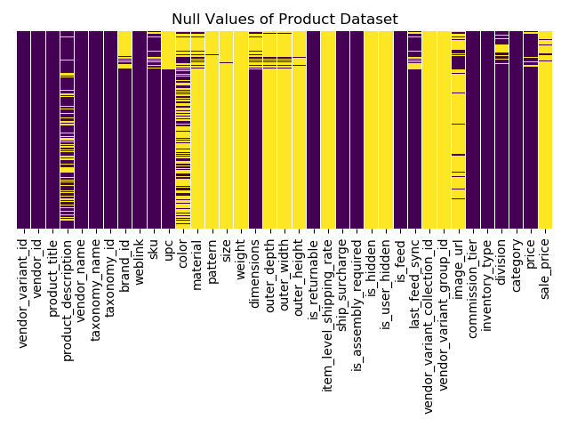

# Recommending Similar Products.... Easy right?  

  

### The Goal

* Build a recommender that will take one product and recommend similar products, in type, style and price.

### The Data and Feature Engineering

For this project, I worked with a sample of the product data from Havenly, which consisted of ~300,000 rows with the following columns:

```python
['vendor_variant_id', 'vendor_id', 'product_title',
 'product_description', 'vendor_name', 'taxonomy_name', 'taxonomy_id',
 'weblink', 'color', 'material', 'pattern', 'is_returnable',
 'ship_surcharge', 'is_assembly_required', 'is_feed', 'commission_tier',
 'inventory_type', 'division', 'category', 'price', 'sale_price']
 ```
My first task was seeing how many null values were in the data and figuring out how I wanted to deal with them.


The yellow represents the null values.  


 Steps taken to clean the data:
 * Drop any columns comprised entirely of NaNs
 * Drop columns that wouldn't be used for clustering
 * Drop rows without a price or sale price
 * Fill the null values of the sale_price columns with the item's price (i.e. this item is not on sale)
 * Fill any null values with 'other' in categorical columns
 * Drop any remaining columns that still have null values ('brand_id','sku','upc','size','dimensions','image_url')

 

 As shown above, my sample is primarily art, which makes recommending for products outside of that category difficult. I performed the clustering and recommending using all categories to start and then restricted to only those in the 'art' category.

### The Clustering

Since my data contains product titles, product descriptions and certain product features, I combined all columns with string values into one column, named 'combo', in order to use NLP for clustering.

I chose 4 initial clustering methods to try:

* NLP (TfIdfVectorizer) + cosine similarity
* Latent Dirichlet Allocation + cosine similarity
* MiniBatchKMeans
* Hierarchical clustering

The hierarchical clustering made for some cool looking plots...

But didn't prove to be much help.

I decided to limit my clustering comparison to the other three methods.

Once I had my methods, I had to find a way to incorporate the price restraints with my clusters. After all, you wouldn't want to plan on spending $100 on a chair and have a $1000 chair recommended to you. For this, I added a user input to specify the desired price range.

Fun fact: the most expensive product in my sample is a crystal chandelier for a whopping $19,045.00.


Parameters used for all:
* Subset_size = 35,000
* No tokenizer used for any vectorizer

Parameters used for Cosine Similarity:
* TfIdfVectorizer

Parameters used for LDA:
* CountVectorizer
* batch_size = 100
* max_iter = 10

Parameters used for MiniBatchKMeans:
* TfIdfVectorizer
* n_clusters = 50
* batch_size = 100 (default)


### The Results

Comparing the three methods with the dataset restricted to the 'art' category:

``` python
Please enter the index of your item (up to 236706): 9490
Your chosen item is 'Blury Style' Graphic Art Print on Wrapped Canvas, which costs $101.99


What is your price range?
 (Please enter your range as min-max): 50-300
Would you like to use Cosine Sim, LDA, or Kmeans? Kmeans
How many recommendations would you like? 3
This'll take a second...
Mini Batch KMeans:

Recommending 3 products similar to 'Blury Style' Graphic Art Print on Wrapped Canvas...
-------
Recommended: 'Meditation and Calming (64)' Photographic Print on Canvas
Price: $157.99
Recommended: 'Portrait Style Photography (599)' Photographic Print on Canvas
Price: $99.99
Recommended: 'Abstract Point of View (127)' Graphic Art Print on Canvas
Price: $82.99
```
Our chosen item:  
  

Combo string: 
"'Blury Style' Graphic Art Print on Wrapped Canvas  
Gallery wrapped canvas prints feature a poly cotton blend. A chemistry perfect protects against moisture and harmful UV rays.   Posters, Prints, & Visual Artwork  
other"

Cosine Sim Recommendations:  


LDA Recommendations:  


KMeans Recommendations:  


Testing on the other categories:  
Chosen item:  


Cosine Sim Recommendations:  


LDA Recommendations:  


KMeans Recommendations:  


It appears that the clustering works well on the non-art categories, but keep in mind that our dataframe was reduced to 55,519 samples, and then further reduced with the specified price range.

### The Improvements?

KMeans clustering seemed to produce the "best" recommendations over cosine similarity and LDA, so I played around with some of the KMeans parameters to see if I could improve the recommendations. Since all of the art pieces had the same category, taxonomy name and color (other), I only used product title, product description and material in the combo column. I also added the WordNetLemmatizer, decreased the batch size to 20, and added the column names, art, print, graphic, wall and canvas to the stop words.

Back to our first item...  


KMeans Recommendations Run #1:    


KMeans Recommendations Run #2:  


KMeans Recommendations Run #3:  


KMeans Recommendations Run #4:  


Have these adjustments improved the recommender? You tell me.

### Future Work

* Add to the stop words to see if that improves clustering.
* Try to cluster and label the 'unmapped - misclassified' products.
* Obtain a dataset with more of the unrepresented categories.
* Use neural networks to incorporate image processing to improve the labels and recommendations, especially for the art category.
* Add an element to the recommender that will recommend products that maximize profit for Havenly.


## References

Special thanks to Bill Sherby and the people at Havenly for allowing me to work with their data.
