# Recommending Similar Products.... Easy right?  

  

### The Goal

* Initially: build a recommender that will take one product and recommend similar products, in type, style and price.
* Transformed into: build a recommender that will take one art piece and recommend similar art pieces.

## Table of Contents
1. [Data and Feature Engineering](#the-data-and-feature-engineering)
2. [NLP Recommender](#the-text-method)
3. [NLP Results](#the-text-results)
4. [Neural Net Recommender](#the-images-method)
5. [Neural Net Results](#the-images-results)
6. [Web application](#the-app)
7. [Future Steps](#future-work)
8. [References](#references)

### The Data and Feature Engineering

For this project, I worked with a sample of the product data from a local company, which consisted of ~300,000 rows with columns such as category, vendor, title, price and description.

 Steps taken to clean the data:
 * Drop any columns comprised entirely of NaNs
 * Drop columns that wouldn't be used for clustering
 * Drop rows without a price or sale price
 * Fill the null values of the sale_price columns with the item's price (i.e. this item is not on sale)
 * Fill any null values with 'other' in categorical columns
 * Drop any remaining columns that still have null values

 

 As shown above, my sample is primarily art, which makes recommending for products outside of that category difficult. I restricted to only those in the 'art' category for both recommenders.

### The Text Method

#### The original method

Since my data contains product titles, product descriptions and certain product features, I combined all columns with string values into one column, named 'combo', in order to use NLP for clustering.

I chose 3 initial clustering methods to try:

* NLP (TfIdfVectorizer) + cosine similarity
* Latent Dirichlet Allocation + cosine similarity
* MiniBatchKMeans

Once I had my methods, I had to find a way to incorporate the price restraints with my clusters. After all, you wouldn't want to plan on spending $100 on a chair and have a $1000 chair recommended to you. For this, I added a user input to specify the desired price range.

Parameters used for all:
* Subset_size = 35,000
* No tokenizer used for any vectorizer

Parameters used for Cosine Similarity:
* TfIdfVectorizer

Parameters used for LDA:
* CountVectorizer
* batch_size = 100
* max_iter = 10

Parameters used for MiniBatchKMeans:
* TfIdfVectorizer
* n_clusters = 50
* batch_size = 100 (default)

#### The updated method

Once I successfully built the NLP recommender with a subset of the data, I converted the code to Spark to use the entire dataset using the following pipeline and Spark KMeans clustering. This is the recommender used in the app.

``` python
    tokenizer = Tokenizer(inputCol="combo", outputCol="words")
    remover = StopWordsRemover(inputCol="words", outputCol="filtered")
    hashingTF = HashingTF(inputCol='filtered', outputCol="rawFeatures", numFeatures=100)
    idf = IDF(inputCol='rawFeatures', outputCol="features")
    pipeline = Pipeline(stages=[tokenizer, remover, hashingTF, idf])
```
The following sections correspond to the NLP recommender without using Spark.

### The Text Results

Comparing the three methods with the dataset restricted to the 'art' category:

``` python
Please enter the index of your item (up to 236706): 9490
Your chosen item is 'Blury Style' Graphic Art Print on Wrapped Canvas, which costs $101.99


What is your price range?
 (Please enter your range as min-max): 50-300
Would you like to use Cosine Sim, LDA, or Kmeans? Kmeans
How many recommendations would you like? 3
This'll take a second...
Mini Batch KMeans:

Recommending 3 products similar to 'Blury Style' Graphic Art Print on Wrapped Canvas...
-------
Recommended: 'Meditation and Calming (64)' Photographic Print on Canvas
Price: $157.99
Recommended: 'Portrait Style Photography (599)' Photographic Print on Canvas
Price: $99.99
Recommended: 'Abstract Point of View (127)' Graphic Art Print on Canvas
Price: $82.99
```
Our chosen item:  
  

Combo string: 
"'Blury Style' Graphic Art Print on Wrapped Canvas  
Gallery wrapped canvas prints feature a poly cotton blend. A chemistry perfect protects against moisture and harmful UV rays.   Posters, Prints, & Visual Artwork  
other"

Cosine Sim Recommendations:  


LDA Recommendations:  


KMeans Recommendations:  


### The Improvements?

KMeans clustering seemed to produce the "best" recommendations over cosine similarity and LDA, so I played around with some of the KMeans parameters to see if I could improve the recommendations. Since all of the art pieces had the same category, taxonomy name and color (other), I only used product title, product description and material in the combo column. I also added a WordLemmatizer, updated batch size to 20, and added domain specific words to my stop words.

Back to our first item...  


KMeans Recommendations Run #1:    


KMeans Recommendations Run #2:  


KMeans Recommendations Run #3:  


KMeans Recommendations Run #4:  


## The Images Method

Since some of my dataset had image URLs, I wanted to cluster art pieces using image processing through a CNN Autoencoder, then clustering with KMeans on the compressed images.

First, I saved a subset of 1996 of the total ~16,000 images from the image URLs to my local computer, resized them to be 256x256, and converted them to arrays using CV2. I split up these images into train, test and val with 80%, 10% and 10% in each, respectively.

The Autoencoder:

|Layer (type)|Output Shape|Param #
|------------|------------|--------|
|input_1 (InputLayer) |(None, 256, 256, 3) |       0
|conv2d_1 (Conv2D)     |        (None, 256, 256, 128)  |    3584
|max_pooling2d_1 (MaxPooling2 |(None, 128, 128, 128)    |  0
|conv2d_2 (Conv2D)  |           (None, 128, 128, 64)     |  73792
|max_pooling2d_2 (MaxPooling2| (None, 64, 64, 64)|         0
|conv2d_3 (Conv2D)  |           (None, 64, 64, 32)  |       18464
|max_pooling2d_3 (MaxPooling2 |(None, 32, 32, 32)    |     0
|conv2d_4 (Conv2D)   |          (None, 32, 32, 32)      |   9248
|up_sampling2d_1 (UpSampling2 |(None, 64, 64, 32)  |       0
|conv2d_5 (Conv2D)   |          (None, 64, 64, 64)    |     18496
|up_sampling2d_2 (UpSampling2 |(None, 128, 128, 64)  |     0
|conv2d_6 (Conv2D)    |         (None, 128, 128, 128)   |   73856
|up_sampling2d_3 (UpSampling2 |(None, 256, 256, 128)  |    0
|conv2d_7 (Conv2D)    |         (None, 256, 256, 3)    |    3459


Based on the above loss plot, I trained my autoencoder on 1597 images in X_train with 6 epochs on 200 images in X_test.

Using the image arrays from the encoded layer of the autoencoder, I applied KMeans to all 1996 images.


Based on the elbow plot and to be consistent with the NLP model, I chose to use 50 clusters for this model.  
 
## The Images Results

Examples of restored images from the autoencoder:
Before | After:  
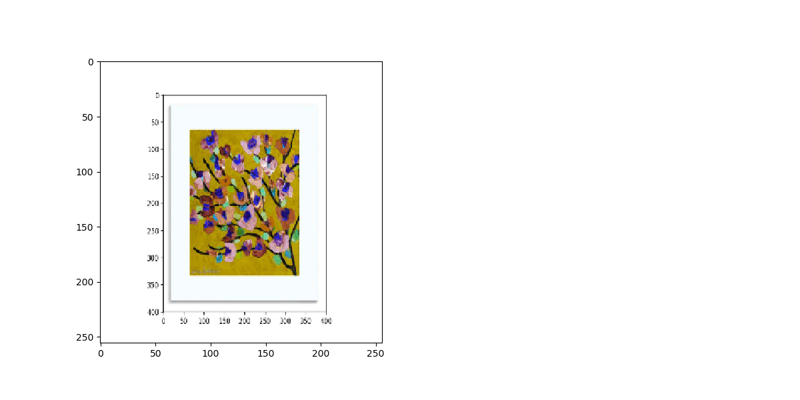 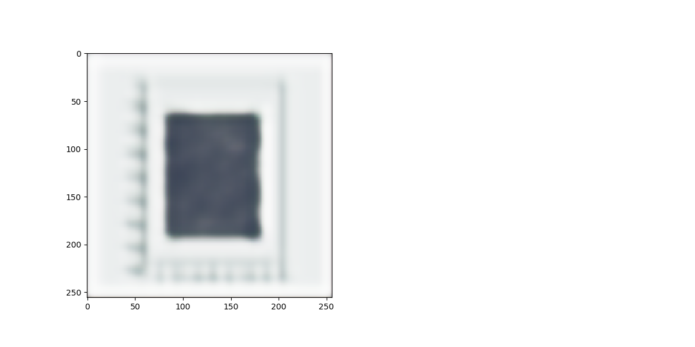 
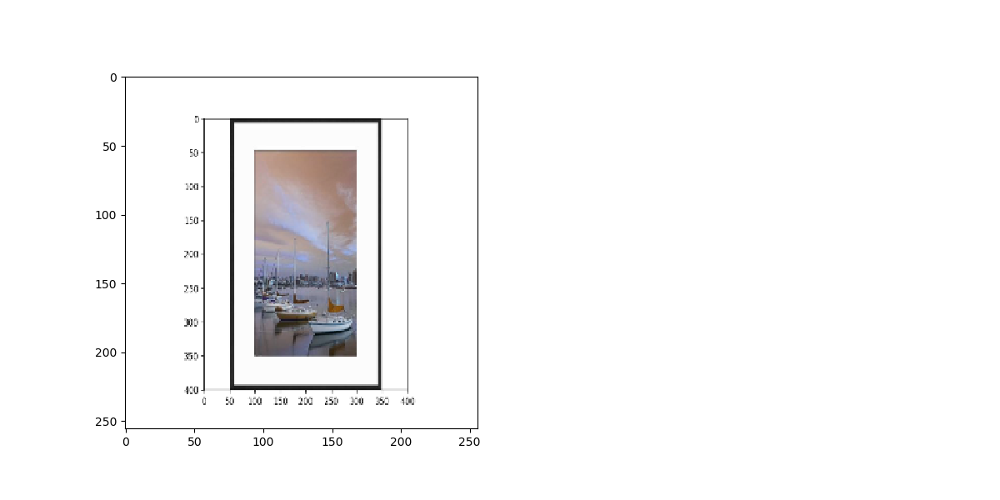 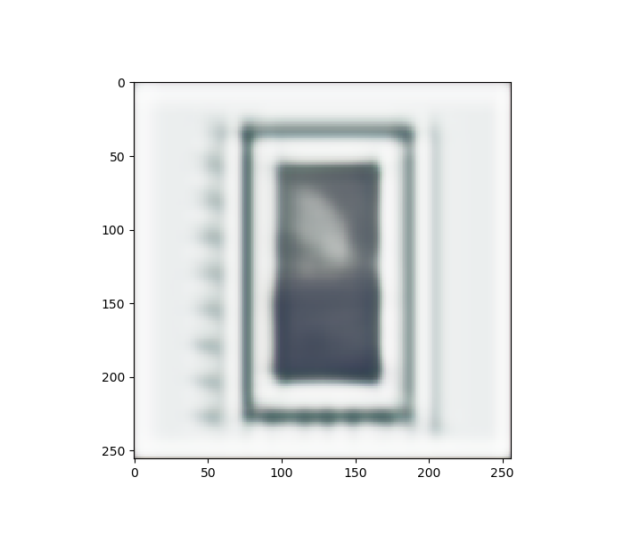 
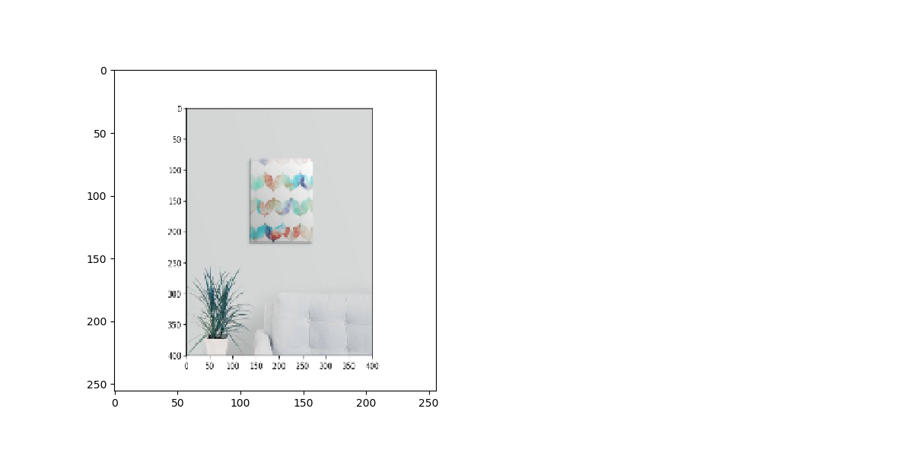 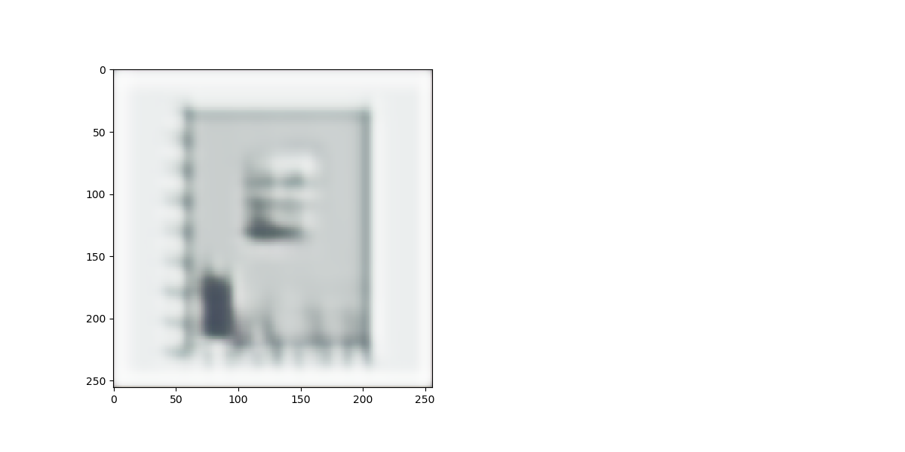 
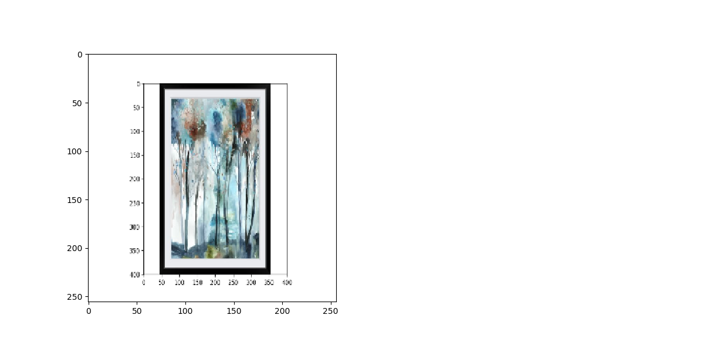 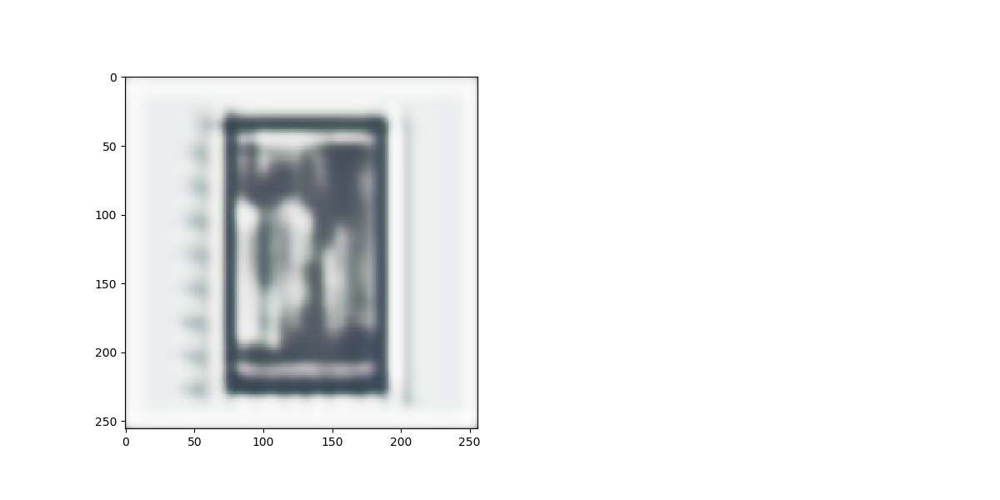 
 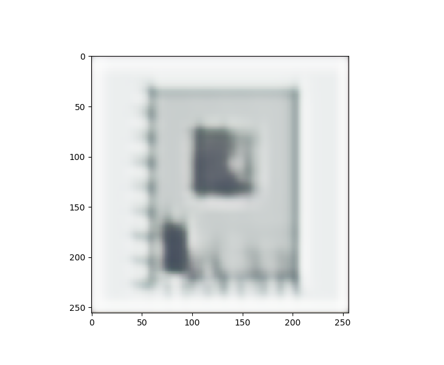 


## The App
[Art Recommender](http://www.artrecommender.com)  

On the home page, you can choose whether you would like to get recommendations using NLP + clustering or the autoencoder + clustering:  
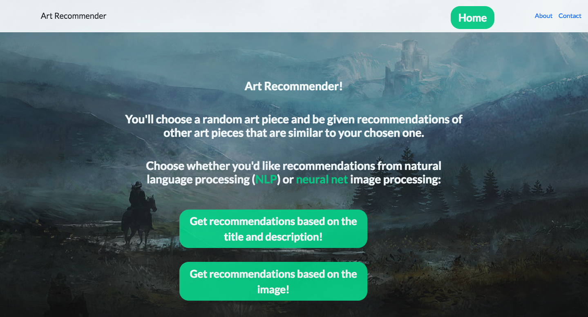 
From there, you choose either a title that you like the most (for NLP) or an image that you like the most (for neural net). For NLP, you can also enter a price range.  
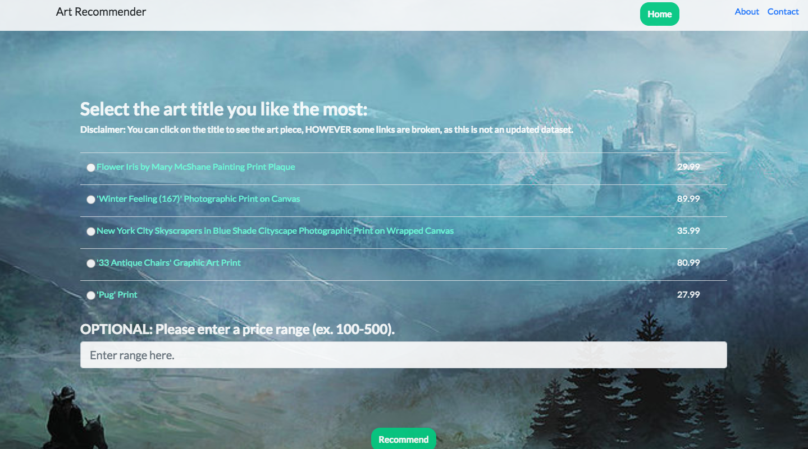    
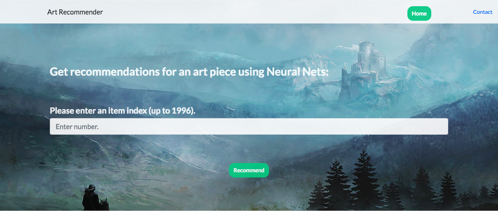  
Once you get your recommendations, you have the option to get more recommendations based off any of the titles or images that popped out.
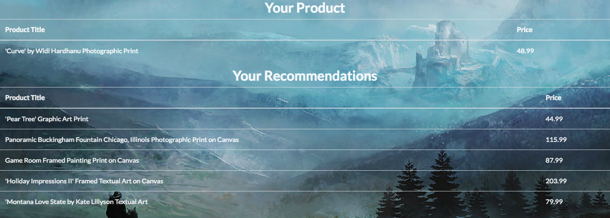
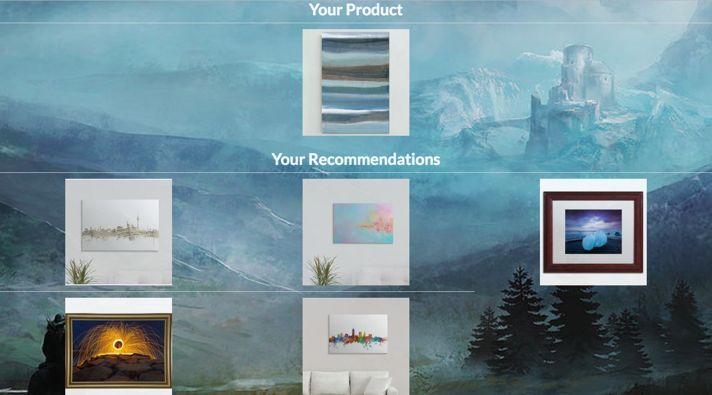  

## Future Work

* Add to the domain specific stop words to see if that improves clustering.
* Try to cluster and label the 'unmapped - misclassified' products.
* Obtain a dataset with more of the unrepresented categories.
* Tune the autoencoder more.
* Train the autoencoder on more art images.
* Add an element to the recommender that will recommend products that maximize profit.
* Add functionality to the app that allows users to click on a recommended art piece and get recommendations based on that.


## Reference

Special thanks to the local company for allowing me to work with their data, and to <a href=https://github.com/michellesklee/wedfuly_recommender>Michelle Lee</a> for her inspirational code and project.
